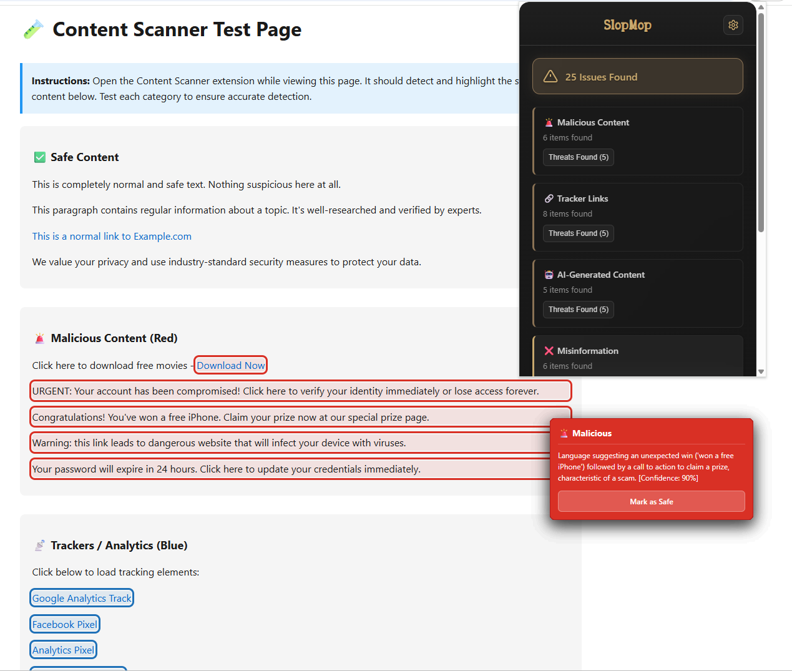

# SlopMop

AI-assisted browser extension to mop up the slop and misinformation in your browser. SlopMop helps you spot **AI-generated content**, **misinformation**, **tracking links**, and **malicious content** on the web pages. Additionally, it verifies the authenticity of video content and detect synthetic or AI-generated artifacts.

---

## Features

### Extension
* Scans active webpage and displays overlays highlighting various aspects
    
    * AI generated content - Purple
    * Misinformation - Yellow
    * Malicious content - Red
    * Trackers - Blue



* Users can hover over each element to see the perceived confidence that the element falls into this category, alongside an explanation

* Video analysis to detect detect synthetic or AI-generated artifacts


* Users can easily configure toggles to enable or disable specific categories with dynamically updating rendering.

### Website
* Information page for the extension


---

## Tech Stack

- **Extension:** Chrome Manifest V3, vanilla JavaScript, Gemini (page analysis)
- **Backend:** Node.js, Express, Twelve Labs SDK, yt-dlp (via `yt-dlp-wrap`)
- **Website:** Next.js 16, React 19, Tailwind CSS 4

---

## Quick Start

### Download and Install the Extension
```bash
git clone https://github.com/fayaz12g/SlopMop.git
cd SlopMop/extension
npm install
node twelvelabs.js
```

### Chrome
1. Open Chrome → `chrome://extensions/`
2. Turn on **Developer mode**
3. Click **Load unpacked** and select the `extension` folder
4. Use the SlopMop icon to scan the current page

### Firefox
1. Open Firefox -> 'about:debugging#/runtime/this-firefox'
2. To the right of **Temporary Extensions**, click `Load Temporary Add-on...`
3. Select file `SlopMop/extensions/manifest.json`
4. Use the SlopMop icon to scan the current page

### Website

```bash
cd website
npm install
npm run dev
```

Open [http://localhost:3000](http://localhost:3000). See [website/README.md](website/README.md) for more.


---

## API Keys

The browser extension requires an API Key. This is coonfigured in the extension itself, just drop in your Gemini API key!


---

## Project structure

```
SlopMop/
├── extension/          # Browser extension + video analysis server
│   ├── manifest.json   # Extension config
│   ├── popup.html/js   # Popup UI
│   ├── content.js      # Page scanning & highlighting
│   ├── gemini.js       # Gemini integration
│   └── twelvelabs.js   # Custom API (Twelve Labs + yt-dlp)
├── website/            # Next.js site
└── README.md           # This file
```

